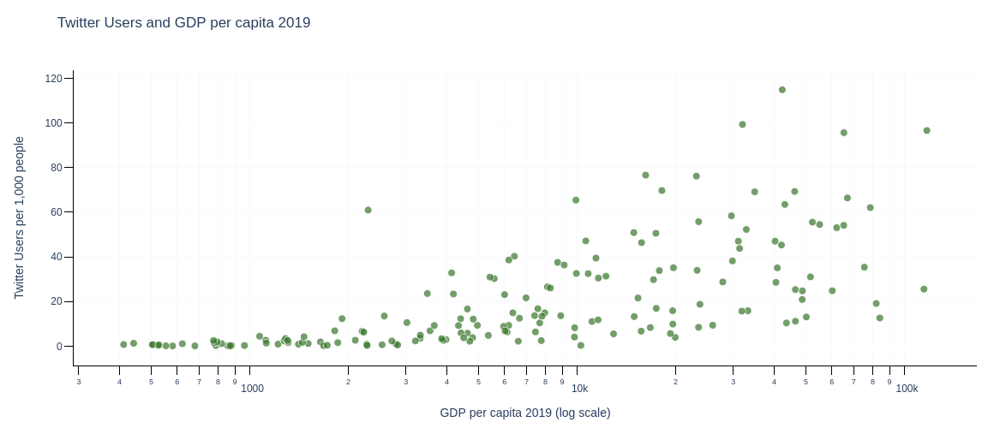
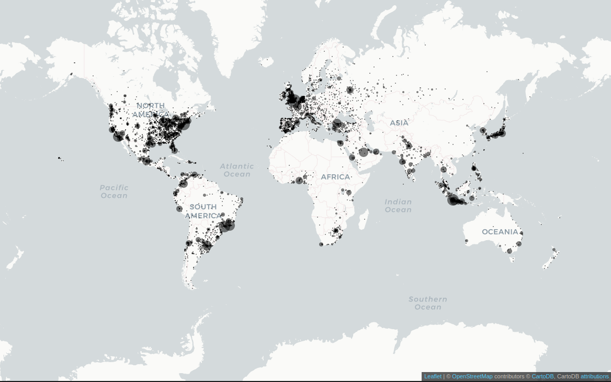
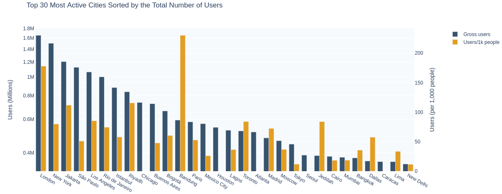

# Twitter tutorials

## Introduction
The rapid escalation of the COVID-19 crisis has emphasized the need to extract real-time policy insights from big data sources, especially in developing countries. In this project, we provide training material to educate development reseachers and practitioners on how to generate indicators from Twitter data on key issues associated with the COVID-19 crisis, with a focus on unemployment, public sentiment, and misinformation, highlighting practical examples focusing on Brazil, Mexico, and Pakistan.

## Content
This repository contains the following:
- A `notebooks` folder containing the Jupyter notebooks in `ipynb` format and related files
  - `1-download-from-twitter-api.ipynb`: details how to download tweets from the Twitter API using the module `tweepy`
  - `2-machine-translation.ipynb`: shows how to use state-of-the-art translation models from the Hugging Face model hub
  - `3-sentiment-analysis.ipynb`: performs sentiment analysis on Pakistani tweets with Hedonometer
  - `4-build-unemployment-index.ipynb`: builds an unemployment index from tweets located in Mexico 
  - `5-misinformation-analysis.ipynb`: quantifies misinformation in COVID-19-related tweets by looking for links whose domains are listed as fake news by [Newsguard](https://www.newsguardtech.com/coronavirus-misinformation-tracking-center/)
  - `6-gender-inference`: infers the gender of Twitter users located in Brazil 
  - An `outputs` folder containing graphs produced using these notebooks
- `README.md`: the present file

## Requirements
- The notebooks are written in Python 3. A basic knowledge of Python and of the most common Python modules such as `pandas` is required to understand these tutorials.
- There are no compulsory package requirements as all notebooks can be run on the cloud in Google Colab. To open a notebook in Google Colab, simply click on the  icon at the top of that notebook. In case you prefer to run the notebooks locally, specific package requirements are indicated at the top of each notebook.

## Motivation

### Twitter as a complementary data source

The booming use of social media platforms, such as Twitter, made individuals’ daily preoccupations and interests observable to researchers. Indicators derived from social media measures can help identify shifts in public opinion in real time and study attitudes and behaviors that might be hard to capture from traditional surveys. It can also inform and enhance the targeting of surveys as well as bring a new lens to understand public opinion on economic policy. On top of their informational value, these new data sources have the advantage of being easily accessible. In the case of Twitter, the data is accessible, with some download limit rate, to all users with a Developer account. World Bank staff also have the opportunity to access to the [Twitter Decahose](https://developer.twitter.com/en/docs/twitter-api/enterprise/decahose-api/overview/decahose), which provides a continuous stream of 10% of all tweets. 

### Massive Twitter scraping at the World Bank

In 2010, we started building a massive Twitter dataset using the Twitter Decahose. As of February 2021, this dataset contains tweets from more than 120 million geolocated users in 182 countries. Twitter users from our dataset joined Twitter in 2019 or earlier. Only users whose user-informed location contained a city name that could be geocoded with the [Google Geocoding API](https://developers.google.com/maps/documentation/geocoding/overview) were kept. This dataset was already used for several projects, including the early detection of labor market flows ([IC2S2 2020 presentation](https://www.youtube.com/watch?v=ZxFrtUW2dYA&feature=emb_logo)). Using this data taught us valuable lessons on the challenges of working with Twitter data and the best practices to tackle them. 

### Challenges with Twitter data

One important challenge when working with Twitter data is the lack of representativeness of the population of Twitter users. Being on Twitter requires being literate, having a good Internet connection and an email address. As a result, the share of the world's population on Twitter tend to be located in richer countries and regions. This is illustrated in the figure below showing the relationship between Twitter peneration and GDP per capita, for countries with 50 or more Twitter users per 1000 inhabitants and a GDP per capita of at least 10.000 USD (value of 2019). 

*Legend: Number of Twitter users per 1000 inhabitants of a country related this country's GDP per capita.*

Overall, we find that Twitter is over representated as a share of the population in North and South America, Western Europe, Northeast and Southeast Asia. By contrast, only a tiny fraction of the African population is on Twitter. 

*Legend: Estimates of the number of Twitter users per city. Each dot represents a city in which Twitter users reside. The relative size of dots is determined by the gross number of Twitter users. Only city with 300.000 inhabitants or more are represented.*

Some countries have relatively high penetration rate, with more than 5% of their population using Twitter. These countries include developed countries such as the United Kingdom (11.4%), the USA (9.5%) or Canada (6.9%) but also middle income countries,  such as Uruguay (7.6%), Argentina (6.5%) or Venezuela (6%), as well as low-populated countries (Kuwait with 9.9%, Bermuda with 9.6% or Barbados with 6.9%). Estimates of Twitter penetration rate per country can be found [here](https://github.com/worldbank/TwitterEconomicMonitoring/blob/master/visualizations/data/twitter_coverage_countries.csv).

London is the most represented city in terms of gross number of users with 1.6 million Twitter users, followed by New York (1.5 million) and Jakarta (1.2 million). In terms of share of the population using Twitter, the top 2 cities are in Indonesia with 59% of Yogyakarta's inhabitants and 23% of Bandung's on Twitter. Estimates of Twitter penetration rate per city can be found [here](https://github.com/worldbank/TwitterEconomicMonitoring/blob/master/visualizations/data/twitter_coverage_cities.csv). 

Beyond socio-economic and geographical biases, there are large heterogeneity in usage. According to Twitter, estimates from 2011 indicate that 40% of the network’s active users would sign in just to read messages from other users. Some users may not even be humans, with between 9% and 15% of 2017 Twitter active users being bots (Varol et al., 2017).

### Demographic inference as a solution

One solution to this challenge is to combine demographic inference of Twitter users and post-stratification to build more representative samples. One way to get user demographics is to match users with existing datasets containing socioeconomic information on individuals. For instance, Grinberg et al. (2019) match Twitter accounts with U.S. registered voters using their name. When such a dataset as the U.S. voting registry is not available, which is the case for most of the rest of the world, demographics, such as age, gender or whether the account belong to an organization, can be inferred based on user self-reported information (Nguyen et al., 2013; Chamberlain et al., 2017; Wang et al., 2019). In this learning material, we include one notebook with a toy example of how demographic characteristics of Twitter users can be inferred from the data, as a first step to address this challenge. 
 

## References

Chamberlain, B. P., Humby, C., & Deisenroth, M. P. (2017, September). Probabilistic inference of twitter users’ age based on what they follow. In Joint European Conference on Machine Learning and Knowledge Discovery in Databases (pp. 191-203). Springer, Cham.

Dodds, P., Clark, E., Desu, S., Frank, M., Reagan, A., Williams, J., Mitchell, L., Harris, K., Kloumann, I., Bagrow, J., Megerdoomian, K., McMahon, M., Tivnan, B., & Danforth, C.. (2014). Human language reveals a universal positivity bias.

Grinberg, N., Joseph, K., Friedland, L., Swire-Thompson, B., & Lazer, D. (2019). Fake news on Twitter during the 2016 US presidential election. Science, 363(6425), 374-378.

Nguyen, D., Gravel, R., Trieschnigg, D., & Meder, T. (2013, June). " How Old Do You Think I Am?" A Study of Language and Age in Twitter. In Proceedings of the International AAAI Conference on Web and Social Media (Vol. 7, No. 1).

Roesslein, J. (2020). Tweepy: Twitter for Python!URL: https://github.com/tweepy/tweepy.

Varol, O., Ferrara, E., Davis, C., Menczer, F., & Flammini, A. (2017, May). Online human-bot interactions: Detection, estimation, and characterization. In Proceedings of the International AAAI Conference on Web and Social Media (Vol. 11, No. 1).

Wang, Z., Hale, S., Adelani, D. I., Grabowicz, P., Hartman, T., Flöck, F., & Jurgens, D. (2019, May). Demographic inference and representative population estimates from multilingual social media data. In The World Wide Web Conference (pp. 2056-2067).

Thomas Wolf, Lysandre Debut, Victor Sanh, Julien Chaumond, Clement Delangue, Anthony Moi, Pierric Cistac, Tim Rault, Rémi Louf, Morgan Funtowicz, Joe Davison, Sam Shleifer, Patrick von Platen, Clara Ma, Yacine Jernite, Julien Plu, Canwen Xu, Teven Le Scao, Sylvain Gugger, Mariama Drame, Quentin Lhoest, & Alexander M. Rush (2020). Transformers: State-of-the-Art Natural Language Processing. In Proceedings of the 2020 Conference on Empirical Methods in Natural Language Processing: System Demonstrations (pp. 38–45). Association for Computational Linguistics.
